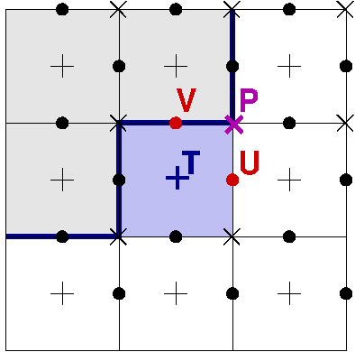

==============
Model numerics
==============

.. toctree::
   :maxdepth: 1

Spatial discretization
======================

The model is based on a C-grid type discretization. Variables are
staggered. Variables obeying a transport equations are treated in
finite volume form. Fluid2d tags them as *tracers*. They are
discretized at cell centers. Fluid2d's key tracer is the
vorticity. Velocity compontents are defined at cell edges. The
streamfunction is defined at cell corners. Cells can be fluid or
solid. The boundary goes along the cell edges and through cell
corners. Imposing a constant streamfunction along the boundary is
therefore straightforward. The no-flow boundary condition is enforced
by construction, at no cost.

   Staggering of variables: tracers T are at cell centers, U and V
   velocity components at cell edges and streamfunction P at cell
   corners. The shown variables have the same logical index (i,j).
   All arrays have the same size (same 'shape' in python wording),
   regardless of their position.

The Poisson equation relating vorticity and streamfunction is written
at cell corners. The model uses a bilinear interpolation to send the
r.h.s. at cell corners.

Time discretization
===================

The model proposes various time schemes: from Euler-forward to RK3,
including LF-AM3 the predictor-corrector scheme of ROMS (the regional
ocean modelling system). All schemes are all explicit.

It is very easy to implement new time schemes. They are all gathered
in the `core/timescheme.py` module. They have been written to be as
close as a textbook formulation.

The time scheme is controlled by

.. code::

   param.timestepping='RK3_SSP'

Advection term
==============

The core of fluid2d is the transport equation. It is coded in
volume-flux form. Each tracer quantity can only be transfered from one
cell to another. This guarantees exact conservation. Fluxes are
computed on cell edges using either centered interpolation or upwinded
interpolation. The former correspond to centered discretization
(either 2nd or 4th order), the latter correspond to odd order (1st,
3rd or 5th). The upwinded discretizations provide a built-in
dissipation that allow to run the code without any explicit
dissipation.

The flux order is controlled by

.. code::

   param.order=5

The Poisson equation
====================

It is solved using a home-made parallel geometric multigrid. The
multigrid is stored in the dedicated folder `core/gmg`. The
restriction and interpolation stages take care of the mask so that
each level of the multigrid sees the boundary, if there is one.

The bulk of the computational time is spent in this module.
